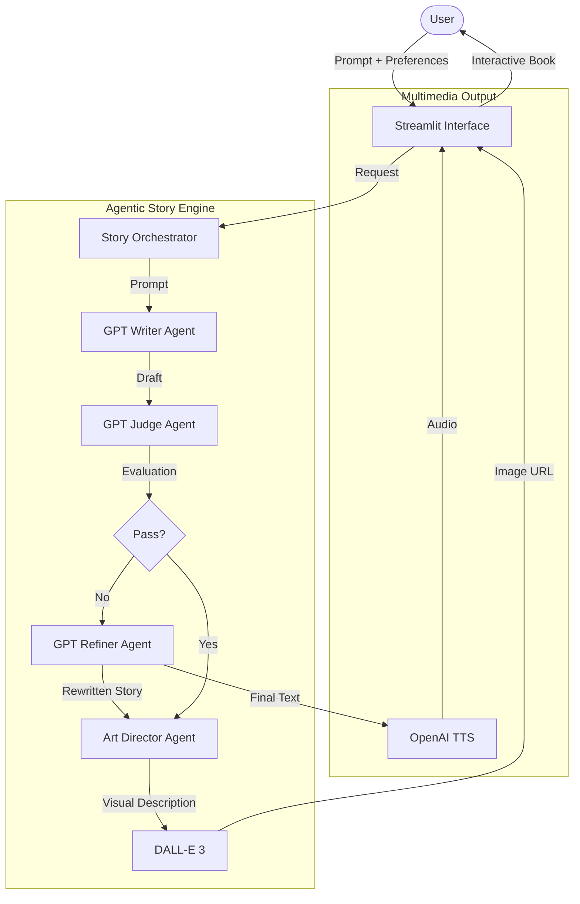

# Bedtime Storybook Agent
A multi-step story generator for ages 5–10 with an LLM writer, judge/refiner loop, DALL-E illustrations, and a 3D “antique book” UI in Streamlit.

## What it does
- Takes a story prompt, drafts with a children’s-author persona, and auto-refines using a judge that enforces age-appropriate, friendly content.
- Generates an illustration prompt and (when an API key is present) a DALL-E image; otherwise uses cached placeholders.
- Presents the result in a 3D book experience with page flips, ambient audio (local tracks), and quick-pick prompt suggestions.

## Quick start
0) *(Optional but recommended)* Create and activate an isolated environment:
   - `python -m venv .venv && source .venv/bin/activate` (or `.venv\Scripts\activate` on Windows)
   - **or** `conda create -n bedtime python=3.10 && conda activate bedtime`

1) Install deps  
`pip install -r requirements.txt`

2) Run the UI  
`streamlit run streamlit_app.py`  
Open the Network URL. Enter your prompt or pick a suggestion, choose ambience, and click “Write Story”.
**or** used the [deployed web interface](https://hippocratic-ai-coding-assignment-7aql6hd3kqdxziz9wl3bts.streamlit.app/) on streamlit.

4) CLI (minimal flow)  
`python main.py`

## Features
- **Agentic loop:** Outliner → Writer → Judge → Refiner (bounded retries).
- **Safety + tone:** Judge enforces vocabulary and family friendly themes for ages 5–10.
- **Illustrations:** DALL-E 3 image generation when key is set; session-cached placeholders otherwise.
- **User Interface:** HTML/CSS book renderer, page navigation, local ambient audio, and floating firefly accents.
- **Prompt ideas:** Sidebar button to fetch fresh prompts (requires key) plus ready-made suggestions.
- **Configurable judge rounds:** Tune how many review/refine passes the AI judge takes before presenting the final tale.

## Notes
- Audio is served from local `musics/` files and embedded as base64 for reliability.
- Autoplay audio may require a user interaction depending on browser policy.

## Flow

_Note: The judge/refiner loop can repeat multiple times (as configured in the sidebar) before advancing to illustration and narration._
